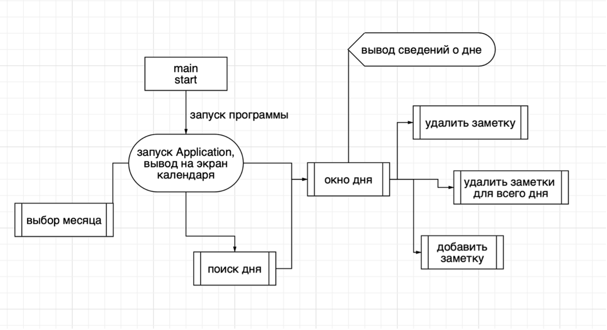
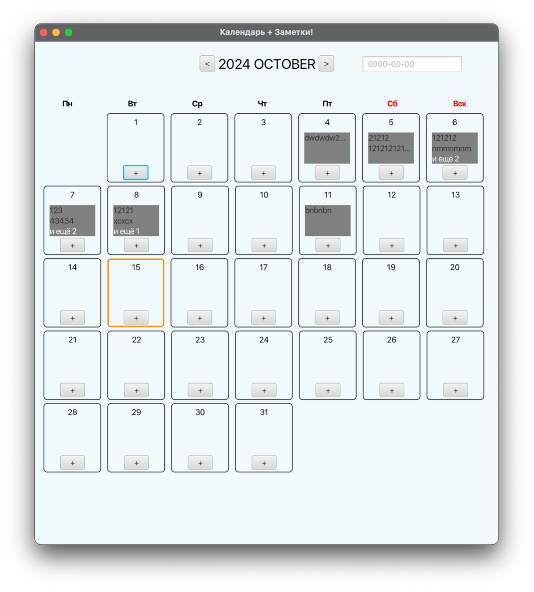
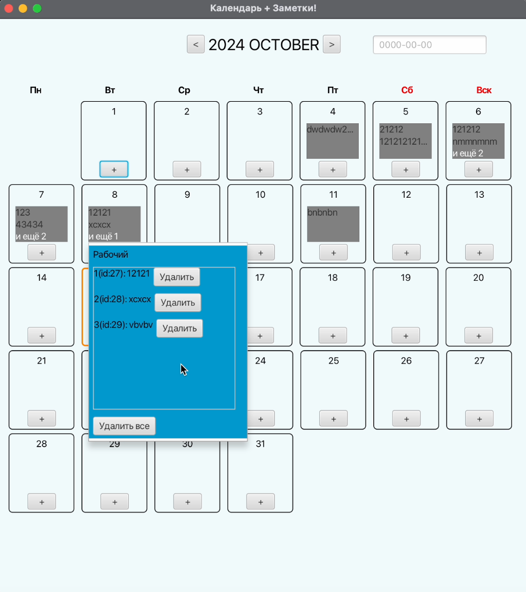
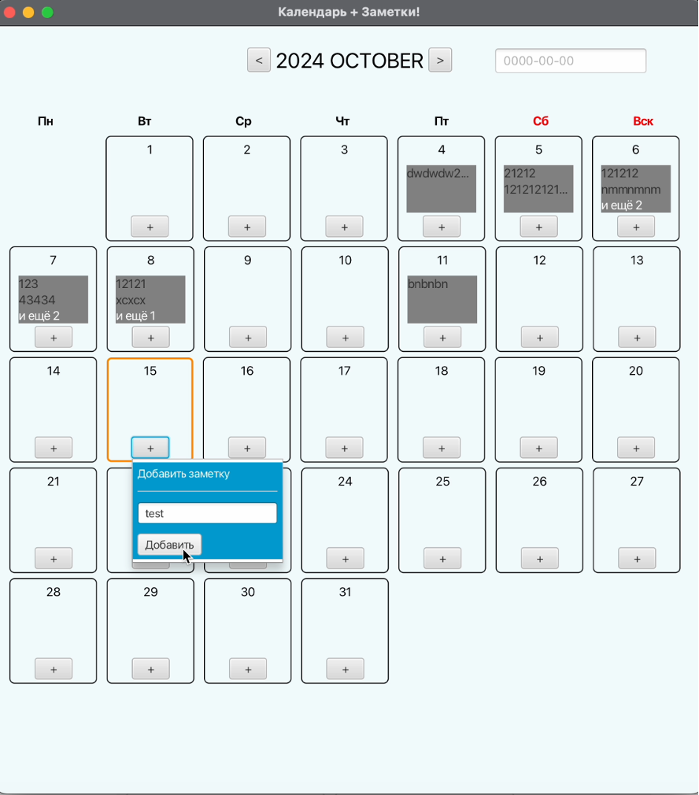
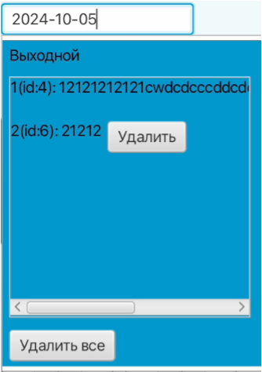
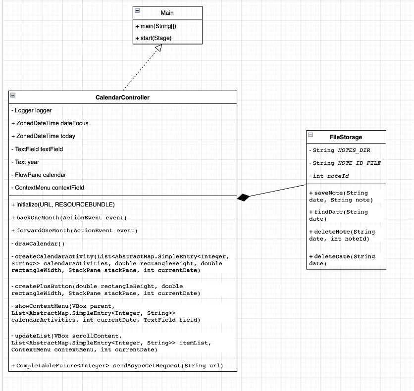
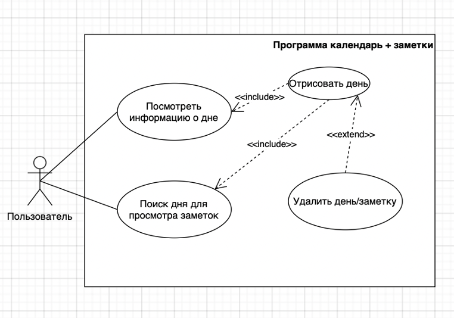

# **Отчет по курсовой работе**

Разработка приложения для работы с заметками и календарем.

# **Введение.**

В современном мире, насыщенном информацией и быстро меняющимися событиями, управление личными задачами и временем становится важной частью повседневной жизни. Приложения для работы с заметками и календарем помогают пользователям эффективно организовывать свои дела, фиксировать идеи и планировать мероприятия. Целью данной курсовой работы является разработка приложения, которое интегрирует функциональность заметок и календаря, предоставляя пользователям простой и интуитивно понятный интерфейс для управления своими задачами.

В процессе работы над приложением будут использованы возможности языка программирования Java, что обеспечит надежность и кросс-платформенность продукта. Приложение будет включать функции создания, поиска и удаления заметки или целого дня заметок.

Актуальность исследования обусловлена необходимостью создания доступных и удобных инструментов для личной продуктивности. В результате реализации проекта планируется не только углубить знания в области разработки программного обеспечения, но и предложить практическое решение для пользователей, стремящихся оптимизировать своё время и ресурсы.

**Основная часть.**

_1\. Библиотеки._

1.1. JavaFX (org.openjfx:javafx-controls, org.openjfx:javafx-fxml).

JavaFX является современным фреймворком для разработки графических пользовательских интерфейсов (GUI) в Java. Это мощное средство для создания богатых на функциональность десктопных приложений, которые могут работать на различных платформах.

JavaFX позволяет разработчикам создавать интерактивные и привлекательные пользовательские интерфейсы. Он поддерживает различные элементы управления, такие как кнопки, текстовые поля, таблицы, деревья и многое другое. JavaFX включает в себя средства для работы с 2D и 3D графикой, а также анимациями. Это позволяет создавать динамичные и визуально привлекательные приложения. Стилизация компонентов GUI в JavaFX может быть выполнена с помощью CSS, что делает процесс настройки внешнего вида элементов более гибким и удобным. JavaFX поддерживает паттерн Model-View-Controller (MVC), что обеспечивает четкое разделение логики и интерфейса, способствуя более чистому и организованному коду.

JavaFX делает интерфейс пользователя более интуитивно понятным и удобным, что улучшает общее впечатление от использования приложения. Приложения, разработанные с использованием JavaFX, могут работать на любой платформе, поддерживающей Java, что обеспечивает большую гибкость и доступность.

В моем приложении JavaFX используется для создания и управления графическим пользовательским интерфейсом. Создание окон, кнопок, текстовых полей и других элементов интерфейса. Обработка действий пользователя, таких как клики мышью, ввод данных и навигация по интерфейсу.

JavaFX является ключевым компонентом приложения, позволяя создать эффективный, гибкий и привлекательный пользовательский интерфейс, который улучшает общее взаимодействие с пользователем и делает приложение более доступным и удобным для широкого круга пользователей.

1.2. Apache Log4j (org.apache.logging.log4j:log4j-core).

Apache Log4j является одним из наиболее популярных фреймворков логирования в экосистеме Java. Он предоставляет гибкие средства для записи логов (журналов событий) приложений, что критически важно для отладки, мониторинга и диагностики проблем.

Log4j позволяет эффективно отслеживать и записывать события в приложении, что упрощает процесс обнаружения и устранения ошибок. Также он предлагает гибкую систему конфигурации, позволяющую контролировать, какие сообщения логируются, а также их формат и назначение. Это включает фильтрацию по уровням (например, ERROR, WARN, INFO), настройку форматов вывода и выбор различных целей для логов (файлы, консоль и др.).

Log4j поддерживает различные уровни логирования, позволяя разработчикам классифицировать сообщения по важности, что облегчает анализ и обработку логов. Данный фреймфорк разработан с учетом производительности, минимизируя нагрузку на приложение при записи логов.

Логи являются ценным инструментом для разработчиков на всех этапах жизненного цикла приложения, от разработки до поддержки. Регулярное логирование помогает обнаруживать и предотвращать потенциальные проблемы, прежде чем они приведут к сбоям или ошибкам в приложении. Логи могут быть использованы для аудита и обеспечения соответствия различным нормативным требованиям, путем предоставления исторических данных о работе приложения.

В моем приложении Apache Log4j используется для:

**_Записи событий приложения:_** фиксация ключевых событий работы приложения, таких как начало выполнения определенных задач, ошибки, предупреждения и другие значимые моменты.

**_Отладка:_** помогает в процессе разработки и отладки, позволяя легко отслеживать и устранять ошибки.

**_Мониторинг:_** обеспечивает возможность мониторинга работы приложения, записывая информацию о его действиях и состоянии.

_2\. Классы. Блок-схема приложения._

2.1. Класс CalendarController.

Главный класс приложение, контроллер всей структуры, проводит инициализацию календаря, хранит состояние месяца и выбранного дня.

2.2. Класс FileStorage.

Вспомогательный класс для реализации локального хранилища заметок, в нем заданы методы обращения к хранилищу, удаления, добавления и поиска заметок.

2.3. Класс Main.

Это основной класс приложения, использующий JavaFX для создания пользовательского интерфейса. Он отвечает за запуск приложения и настройку пользовательского интерфейса, включая кнопки и поля для вывода.

2.4. Блок-схема алгоритма работы приложения.

Далее была разработана блок-схема, показывающая основную работу приложения со всем функционалом:

  

Рис. 1. Блок-схема алгоритма

_3\. Работа приложения._

3.1 Запуск приложения и “главный” экран, отражающий текущий месяц.

  

Рис. 2. Графический интерфейс программы.

3.2. Отображение информации о дне: отображение того, выходной день или рабочий(обработка http-get запроса на сайт IsDayOff.ru), список заметок(порядковый номер, идентификатор заметки(который инкрементируется каждый раз при добавлении заметки), содержимое заметки и кнопка “Удалить”, удаляющая заметку), кнопка “Удалить все”, удаляющая заметки на выбранный день.

  

Рисунок 3. Вывод информации о дне с заметками.

3.3. Добавление заметки.

После нажатия “+”, происходит открытие контекстного меню, позволяющего добавить заметку на выбранный день.

  

Рисунок 4. Добавление заметки.

3.4. Поиск заметок для дня.

  

Рисунок 5. Пример поиска по дню.

_4\. UML-диаграмма классов._

  

Рисунок 6. UML-диаграмма классов.

_5\. UML-диаграмма прецедентов._

  

Рисунок 7. UML-диаграмма прецедентов.

**Заключение.**

В ходе курсовой работы были успешно реализованы ключевые аспекты создания приложения для автоматизированной просмотра, сохранения, поиска и удаления заметок на определенный день в календаре. Был разработан интуитивно понятный интерфейс, полностью реализующий данную задачу.

Разработанный механизм успешно считывает и обрабатывает данные из внешних файлов, что является фундаментальной основой для функционирования приложения. Применение современных технологий и библиотек, таких как JavaFX для создания пользовательского интерфейса и Log4j для логирования, позволило создать надежное и функциональное приложение. В процессе разработки были идентифицированы и успешно устранены различные ошибки, что повысило надежность и устойчивость работы приложения.

В результате было создано функциональное приложение, которое не только соответствует первоначальным требованиям, но и демонстрирует гибкость в адаптации к различным сценариям использования.

**Список литературы.**

1. Базовый CalendarView \[Электронный ресурс\]. URL: <https://gist.github.com/IanLivingsCode/11774cbb8995bdeb14f7c49debb446a3> (дата обращения 07.10.24)
2. Обучение JavaFX \[Электронный ресурс\]. URL: <https://metanit.com/java/javafx/1.5.php> (дата обращения 06.10.24)
3. Обращение к локальному хранилищу \[Электронный ресурс\]. URL: <https://javarush.com/quests/lectures/questcollections.level01.lecture01> (дата обращения 08.10.24)
